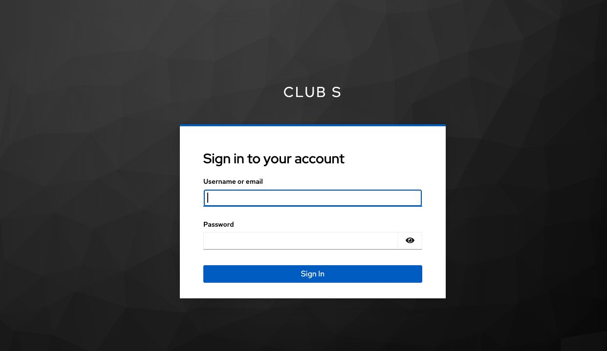
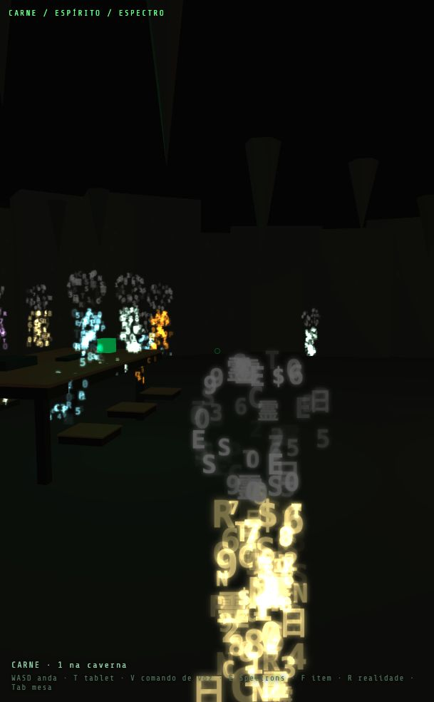

# Axiom SDD: From Intent to Evidence in AI-Assisted Development

*A practical template for teams building software with coding agents.*

The difficult part of working with several coding agents is often deciding what “done” means. One agent has written the backend. Another has prepared a screen. A test suite is green. Yet the running application may still be missing configuration, and the real user journey may never have been exercised.

Axiom SDD makes those distinctions visible. It is a repository-based framework for **Spec-Driven Development**: define the expected behavior, plan the change, assign bounded tasks, implement them, and retain the evidence needed to review the result.

It provides templates, agent roles, workflows, quality gates and a Python command-line installer. The framework is designed to give different coding tools a shared project contract. It does not operate the agents as an autonomous orchestration service, and it does not replace the engineer responsible for acceptance and release.

## A template that becomes a working agreement

A useful specification answers questions that code alone cannot answer: what problem are we solving, which behaviors matter, what is outside scope, and how will we recognize success?

Axiom separates that agreement into artifacts with different jobs:

| Artifact | The question it answers |
|---|---|
| `SPEC.md` | What behavior is required, and what are the acceptance criteria? |
| `PLAN.md` | How should the change fit the architecture? |
| `TASKS.md` | Who owns each bounded step, and what can they do next? |
| `CONTEXT-PACK.md` | Which project information is relevant to this task? |
| `EVIDENCE.md` | What changed, what actually ran, and what remains unproven? |
| Decision records | Why was a tradeoff accepted? |

These are maintained alongside the code. A task points to its acceptance criteria; implementation and tests point back to the task. Reviewers can follow the chain without reconstructing it from a long conversation.

The depth should fit the change. A small fix needs a compact agreement and focused verification. A larger integration needs more explicit architecture and failure behavior. The purpose is to reduce ambiguity, not to produce the largest document set.

## One project contract, several tools

The installer composes a consumer project's `sdd/` directory and generates entry points for selected runtimes. `AGENTS.md` provides the common starting point; tool-specific files direct agents to the same project rules.

This matters when responsibilities are split. Backend work, interface work and verification can proceed independently when their file ownership and contracts are clear. A blocked integration should identify the dependency and its owner, while unrelated authorized work continues.

The framework includes profiles for different kinds of change, such as backend features, bug fixes and legacy refactoring. It uses Python's standard library for its CLI, without a third-party Python package installation step.

## The lesson from a game in development

Club S, a multiplayer experience under development, offers a useful example. Its interface includes a portal, an entry screen and a three-dimensional meeting space. Its backend work includes authentication, room identity and temporary file access.


*Local portal preview captured on October 6, 2026. This is a consumer application, not an Axiom SDD dashboard. Event dates, rental options and commercial labels in the prototype are illustrative or historical, not a current release announcement.*

A visible screen was one kind of evidence. Automated integration checks using a simulated identity provider were another. Neither proved that the actual Keycloak login and browser callback had completed successfully.



*The real sign-in page of the local Keycloak account console, captured with empty fields. This demonstrates that the provider's login interface was reachable. It does not demonstrate a completed Club S application login, callback or authenticated session.*


*The game's nickname-entry screen explicitly distinguishes an alias from authentication.*



*Local development scene with a demonstration alias. This screenshot illustrates the application being built; it is not evidence of production readiness or multiplayer acceptance.*

That distinction shaped the next iteration of the methodology: make progress depend on evidence, and preserve uncertainty where verification is missing.

## What the 2.1.0 changes add

The new `metrics` command reads an optional local `sdd/progress.json`. Each task declares an owner, a next action, a blocker, the required verification mode, and observations referring to saved evidence files.

The command checks the referenced files against their SHA-256 hashes. Repeated observations with the same evidence fingerprint retain their original age. A newer status update cannot, by itself, make old proof fresh.

It also separates missing evidence, incomplete checks and a requirement for real-flow evidence. A simulated passing suite cannot satisfy a task explicitly marked as requiring real verification. Skipped checks remain unproven.

There is an important limit: hashes establish correspondence with files, not that a test genuinely ran or that its declared result is accurate. The report trusts declared counts and verification mode. Reviewers must still examine the evidence and acceptance criteria. It is a local diagnostic aid, not a release certificate, productivity ranking or token-cost measurement.

The update also fixes a concrete ownership bug: an existing consumer `sdd/profile.yaml` is now preserved during update and reinstallation. Project-specific configuration must survive framework evolution.

## Try it on a bounded change

Clone the repository, then install into an existing project:

```bash
python3 cli/axiom.py install --target ../your-project \
  --profile backend-feature --runtimes claude-code,codex --git-mode team --yes
```

Read the generated project entry point and start with one feature. Write observable acceptance criteria, assign a small task, execute the checks and record their limitations.

For projects using the optional progress record:

```bash
python3 cli/axiom.py metrics --target ../your-project
```

See the [metrics guide](../METRICS.md) for the schema and interpretation. Secure evidence reading currently requires POSIX APIs on macOS/Linux; unsupported platforms fail closed for this command. The install/update workflow remains cross-platform.

The 2.1.0 changes passed 13 standard-library regression tests. A local consumer update preserved the hashes of 68 project-owned files checked during rollout. These are bounded validation results, not a claim of measured productivity improvement.

Axiom SDD is useful when a team needs to answer a simple question precisely: **what evidence supports the next step?**

## Em português: do pedido à evidência

O Axiom SDD organiza o desenvolvimento com agentes de IA em um contrato compartilhado dentro do repositório. A especificação define o comportamento esperado; o plano explica a abordagem; as tarefas delimitam responsabilidade; e as evidências mostram o que foi executado e o que ainda falta comprovar.

O objetivo é permitir que várias frentes trabalhem sem confundir atividade com entrega. Uma mensagem no canal não comprova implementação. Uma tela bonita não comprova integração. Um teste com provedor simulado não comprova um login real.

A evolução 2.1.0 acrescenta um relatório local que verifica referências a evidências e sinaliza bloqueios, verificações incompletas e necessidade de validação real. Também corrige a atualização do framework para preservar o perfil personalizado do projeto.

O Club S aparece aqui como um projeto em desenvolvimento que ajudou a revelar essas necessidades. As capturas mostram telas reais do ambiente local, com o estado de cada uma explicado. O login integrado ao jogo ainda depende de validação real; as imagens não substituem esse aceite.

Quem usa o template continua responsável por revisar as evidências, avaliar riscos e decidir o lançamento. A proposta é tornar essas decisões mais claras, rastreáveis e fáceis de revisar.

---

**Explore:** [repository](https://github.com/alexandrehenrique-dev/axiom-sdd) · [2.1.0 pull request](https://github.com/alexandrehenrique-dev/axiom-sdd/pull/1) · [SDD templates](../../templates/README.md) · [verification record](../specs/2.1-evidence-metrics.md)
